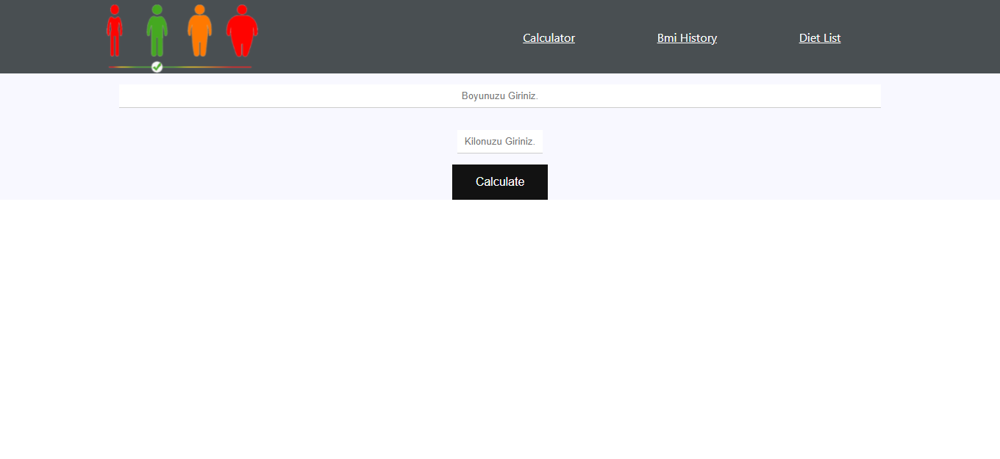
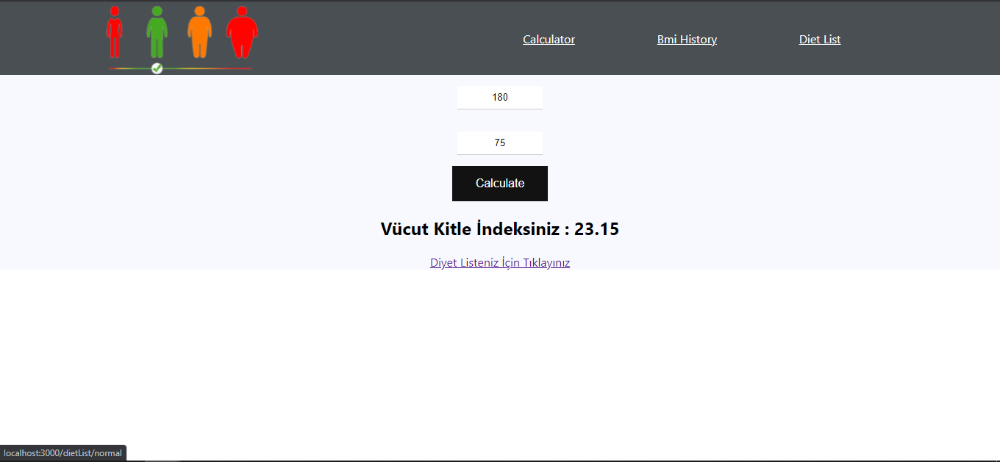
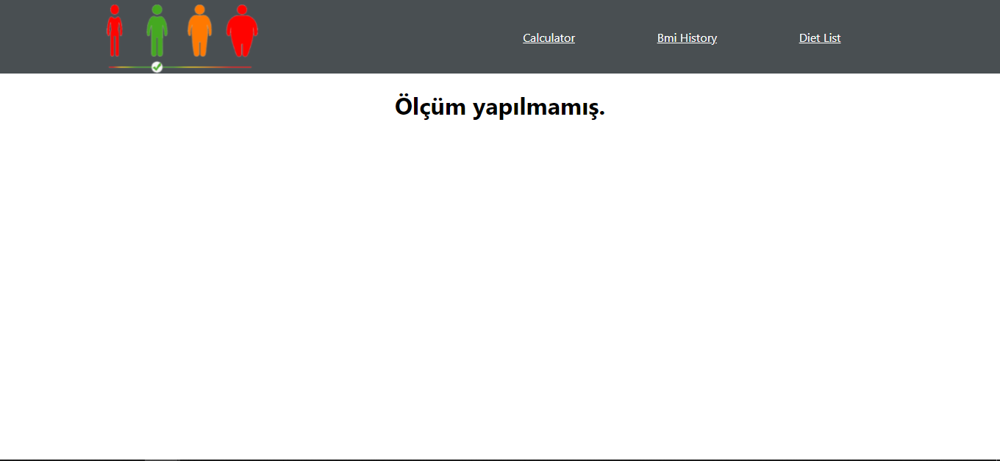
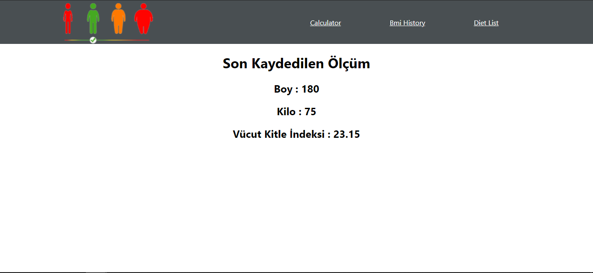
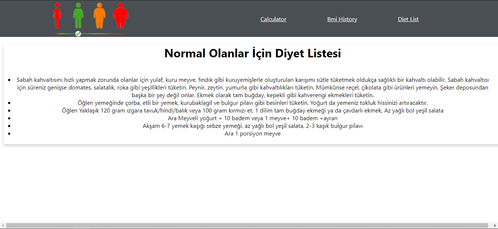
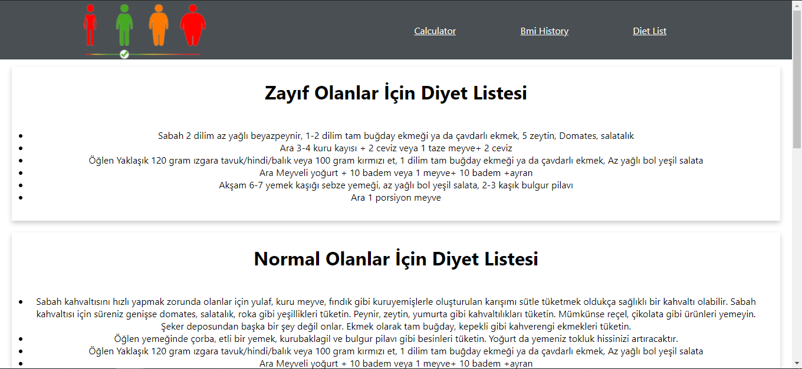

## NETLIFY DEMO
[NETLIFY DEMO - CLICK ](https://agitated-hoover-bd1ddd.netlify.app/)

## Vücut Kitle İndeksi Hesaplama

Uygulamamızda boy ve kilonuzu giriyorsunuz. Size vücut kitle indeksinizi söylüyor ve size uygun diyet programınızı gösteriyor.

### Home Page

  
  

### BMI History Page

  
  

### Personal Page

  

### Diet List Page

  

## Proje Nasıl Çalıştırılır

- Projeyi fork'ladıktan ya da indirdikten sonra projenin bulunduğu klasörde "npm install" komutu ile gerekli paketlerin yüklenmesi gerekiyor.
- Daha sonra "npm run start" komutu ile uygulama başlatılabilir.

## Proje Hakkında

Bu projede, Calculator sayfasında (aynı zamanda home sayfası), vücut kitle indeksinizi hesapladıktan sonra size özel diyet listesi ile karşılaşırsınız. Son ölçümünüzü "Bmi History" kısmından görebilirsiniz. Eğer ölçüm yaptırmadan basacak olursanız "Ölçüm yapılmamış." mesajı ile karşılaşırsınız. Ölçümden sonra alt tarafta size özel diyet listesi görüntülenecektir. "Diet List" kısmından ise bütün diyetleri görüntüleyebilirsiniz.

## Proje Teknik Bilgileri

* Dinamik Url yapısı kullanılmıştır.
* Bilgiler localstorage'e kaydedilmektedir.
* Calculate butonu için Styled Component kullanılmıştır.

## Licence
---
[MIT](https://choosealicense.com/licenses/mit/)
